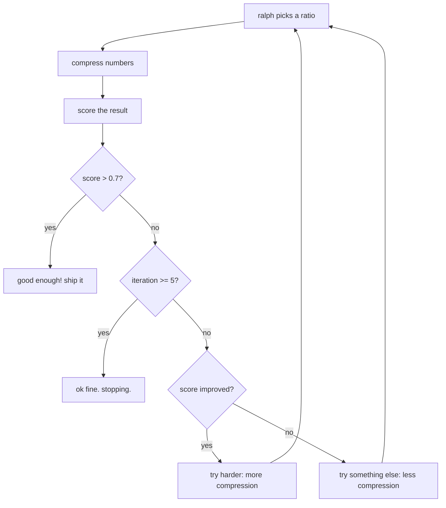

# ralph-loop

> ultra cavemanified loop engineering. one file. no fancy. just loop.

## ELI5 (explain like i'm 5)

you have a pile of 50 numbers. ralph wants to throw some away but
keep the important ones. he doesn't know what "important" means.
he just guesses.

1. ralph picks a number (like "keep half")
2. ralph throws away the numbers furthest from the middle
3. ralph checks: did the average stay roughly the same?
4. if yes: "good enough!" ralph stops.
5. if no: ralph tries a different number.

that's the whole loop. ralph does it 5 times max, then gives up.

## deep dive

### the loop (it's really this simple)



### the scoring formula

ralph's fitness function (he doesn't know it's a function):

```
fitness = mean_preservation * 0.5
        + range_preservation * 0.3
        + compression_bonus
        - over_compression_penalty
```

where:
- **mean_preservation** = 1 - abs(orig_mean - comp_mean) / orig_mean
- **range_preservation** = 1 - abs(orig_range - comp_range) / orig_range
- **compression_bonus** = (1 - ratio) * 0.3
- **over_compression_penalty** = 0.3 if ratio < 0.2

ralph invented this by adding numbers until the score felt right.
there is no theoretical justification. it just works.

### the plan function (vibes-based)

ralph picks the next ratio using a sophisticated algorithm called "vibes":

```
if first iteration:    ratio = 0.5
if last score better:  ratio -= 0.05 (push harder)
if last score worse:   ratio += 0.10 (pull back)
```

this is gradient descent with a step size of vibes.

### what makes this "loop engineering"

even though ralph is a caveman, he follows the four-phase cycle:

| Phase | ralph's version | real Loop Engineering |
|-------|----------------|----------------------|
| Plan | pick a ratio | generate experiment spec |
| Execute | compress numbers | run the experiment |
| Evaluate | score it | measure metrics |
| Decide | good enough / try harder | SHIP / RETRAIN / PIVOT |

the genesis contract exists (it just says "reduce numbers, stop when tired").
the STATE.md exists (ralph updates it, badly).
the correctable loop invariant exists (5 iterations max).

ralph is doing loop engineering. he just doesn't know it.

## the ralph philosophy

1. **one file is enough** -- if you need 7 files, you're over-engineering
2. **if it works, ship it** -- don't optimize what's already good enough
3. **if it doesn't work, try harder** -- but only a little
4. **if trying harder doesn't work, try something else** -- but not too different
5. **if nothing works, take a nap** -- iteration limit is self-care
6. **never over-engineer anything** -- ralph would rather ship imperfect than plan perfect
7. **the loop is already here** -- you're always in a loop, you just don't know it

## files

| File | What it does | Link |
|------|-------------|------|
| `ralph.py` | everything. the whole thing. one file. | [view](https://github.com/peterlodri-sec/longrun-eval-kompress/blob/main/template/examples/ralph-loop/ralph.py) |
| `STATE.md` | ralph's state (he updates it sometimes) | [view](https://github.com/peterlodri-sec/longrun-eval-kompress/blob/main/template/examples/ralph-loop/STATE.md) |
| `genesis.md` | the contract (ralph wrote it) | [view](https://github.com/peterlodri-sec/longrun-eval-kompress/blob/main/template/examples/ralph-loop/genesis.md) |
| `README.md` | you're reading it | [view](https://github.com/peterlodri-sec/longrun-eval-kompress/blob/main/template/examples/ralph-loop/README.md) |

## try it

```bash
cd template/examples/ralph-loop
python ralph.py
```

## who is ralph

named after ralph wiggum, who famously said:

> "i'm in danger!"

which is also how most ml researchers feel during training.

ralph is the spirit animal of every engineer who has ever shipped
something they didn't fully understand, hoped it would work, and
been pleasantly surprised when it did.

ralph doesn't read papers. ralph doesn't attend conferences. ralph
writes one file and sees what happens.

ralph is all of us.
